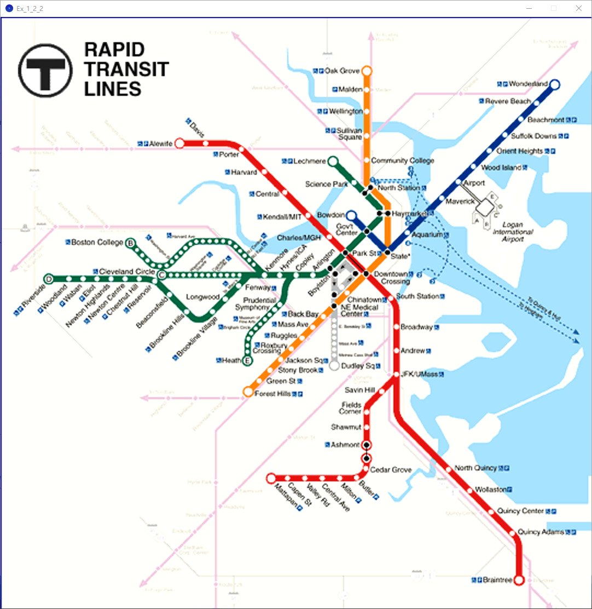
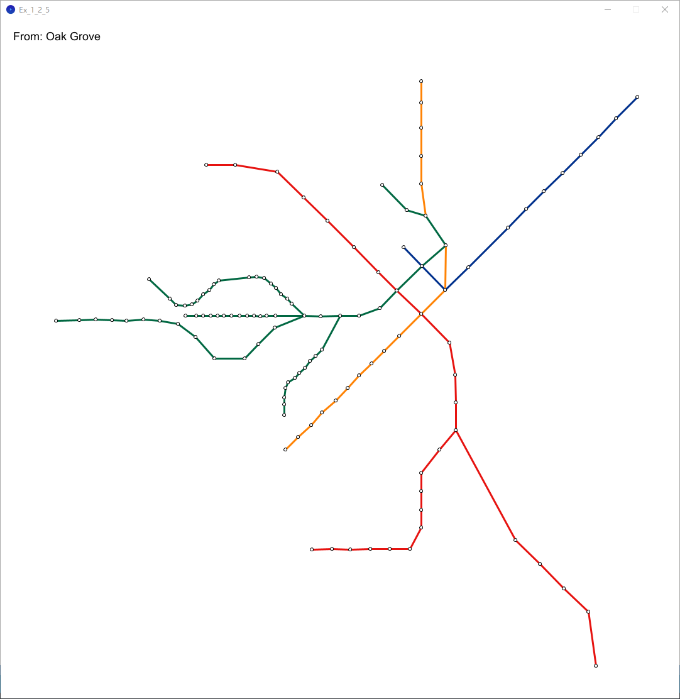
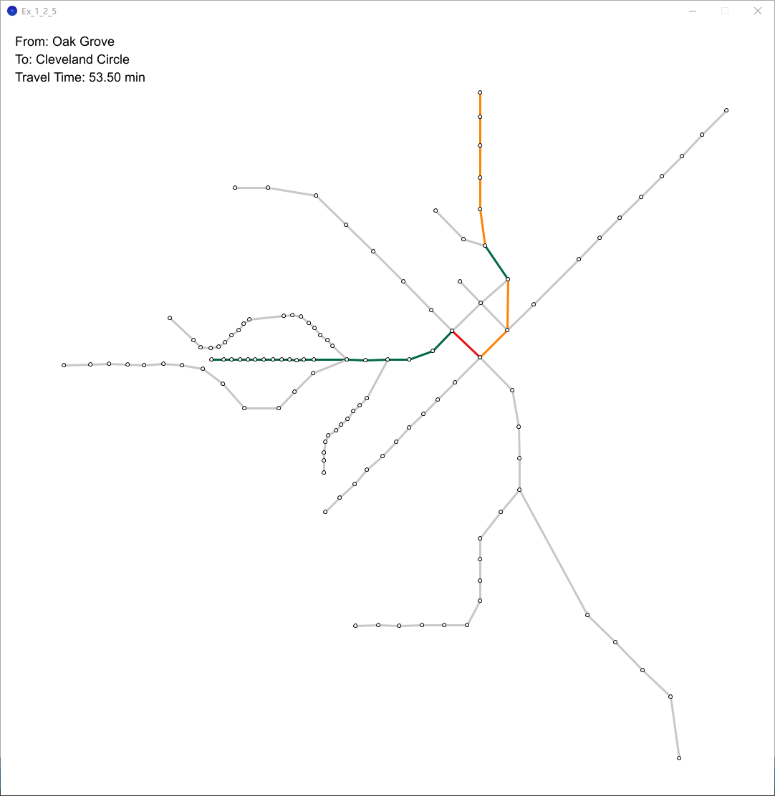

# 🗺️ MBTA Subway Visualization

This is a small, fun visualization project that simulates the Boston MBTA subway system. It allows interactive exploration of station-to-station routes with a focus on clarity and ease of use.

## ✨ Project Summary  
The project collects subway data and uses **Processing** to render a graphical representation of the network. Users can right-click to select a departure and destination station, and the shortest path with estimated travel time is displayed dynamically. Subway lines are color-coded for readability and visual appeal.

## 📂 Included Visuals (stored in the `figures/` folder)
- 
- 
- 

## 🔍 Features
- Custom subway data parsing from HTML
- Interactive UI with right-click station selection
- Real-time shortest path and travel time display
- Colored edges by line for better visualization
- Lightweight and easy to run

## 🚀 How to Run
1. Place `stations.py`, `connections.py`, and `data.html` in the same directory.
2. Run the scripts to generate `stations.csv` and `connections.csv`.
3. Open the Processing sketch and run it.
4. Right-click:
   - First station sets "From..."
   - Second station calculates and displays the shortest route
   - Clicking again resets the map

## 📎 Notes
- CSV files are comma-separated and contain no headers.
- Coordinates for stations are manually captured via mouse and stored in `locations.csv`.
